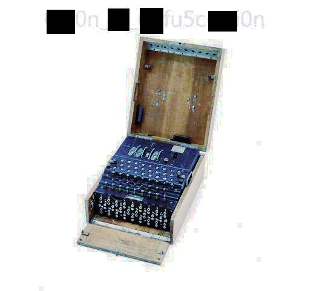

## Solution

```
UPDATE: There was a bug found in cryptii that has now been fixed, but will cause issues on the final step of the challenge. For now, when you find the the cipher text FSXL PXTH EKYT DJXS PYMO JLAY VPRP VO, replace it with this cipher text instead: JHSL PGLW YSQO DQVL PFAO TPCY KPUD TF. Everything else at that step, e.g., the configuration file can remain as-is. I intend to update the challenge file to correct this issue, but this will serve as a temporary fix until that time.


HINT1: if you're not sure if a password is upper- or lower-case, try all lower-case.

HINT2: There are many steps that can be done concurrently in this challenge. If you find you need something, you may have not found the key to unlock it yet. If you have something useful and you're not sure where to use it, it's possible the file you need is still hidden somewhere.

HINT3: https://cryptii.com/ - Cool website, bro

HINT4: the flag will follow the format CCT{.*}
```

Right off the start we can see we got an image with a long name so lets rename that, I changed it to `for1.png`.

When doing steg challenges, my favourite way to start is exiftool -> stegoveritas -> manual.

```
ExifTool Version Number         : 12.42
File Name                       : for1.png
Directory                       : .
File Size                       : 30 kB
File Modification Date/Time     : 2022:07:11 06:44:37-04:00
File Access Date/Time           : 2022:07:11 06:46:56-04:00
File Inode Change Date/Time     : 2022:07:11 06:46:55-04:00
File Permissions                : -rw-r--r--
File Type                       : JPEG
File Type Extension             : jpg
MIME Type                       : image/jpeg
JFIF Version                    : 1.01
Exif Byte Order                 : Big-endian (Motorola, MM)
X Resolution                    : 96
Y Resolution                    : 96
Resolution Unit                 : inches
Artist                          : Ed
Y Cb Cr Positioning             : Centered
Copyright                       : CCT 2019
XMP Toolkit                     : Image::ExifTool 11.16
Description                     : .--- ..- ... - .- .-- .- .-. -- ..- .--. .-. .. --. .... - ..--..
Author                          : Ed
Image Width                     : 514
Image Height                    : 480
Encoding Process                : Baseline DCT, Huffman coding
Bits Per Sample                 : 8
Color Components                : 3
Y Cb Cr Sub Sampling            : YCbCr4:2:0 (2 2)
Image Size                      : 514x480
Megapixels                      : 0.247
```
We can see that the description field looks interesting, it is very obviously morse code, it decodes to `JUSTAWARMUPRIGHT?`, we save that for later!

```

Trailing Data Discovered... Saving
b'PK\x03\x04\x14\x00\t\x00\x08\x00\x91e\xe6N\x0c8H]\x9f\x00\x00\x00\xbd\x00\x00\x00\x0c\x00\x1c\x00fakeflag.txtUT\t\x00\x03\xf2\xcf ]\x16\xd0 ]ux\x0b\x00\x01\x04\x00\x00\x00\x00\x04\x00\x00\x00\x00B\xd1b=s\xdb\xff\xf6&\xe6 A\x83\x10\xc3\xf1\xa4\xb9\x0c,\xdacb\xd3G\xe99\xcd\xc5\xee\xbd\xd7\xf7\xe7D*\xc3\x8eG\xf2"\x1b)\r\xc5\xd8\xf7)\xff\xabJn\x1d\xdd\xd4QR\x11A\xf2Ne\x87{pyu\x91\x18H\xd3m=\x96h[l\x85WW6d\x84\xcd\xd7ox\xcf`\xeb\x05\xe7\xd2\x06K\xc8\xf1JX\x96;\xbf$u\x1a@&\x84\r\xed\xd0{\xd7q\xda\x1c\xf59&\x1e \xdf\x0b"\rqV\x1d\xea\xa1?\x86\x8e\x08G\x9a\xd0\xb1i\x85\x85?[\x1d\xa7\xd7\xe2.\xa1w\x84\x07\n3\x84\xc1\xbfgkPK\x07\x08\x0c8H]\x9f\x00\x00\x00\xbd\x00\x00\x00PK\x01\x02\x1e\x03\x14\x00\t\x00\x08\x00\x91e\xe6N\x0c8H]\x9f\x00\x00\x00\xbd\x00\x00\x00\x0c\x00\x18\x00\x00\x00\x00\x00\x01\x00\x00\x00\xa4\x81\x00\x00\x00\x00fakeflag.txtUT\x05\x00\x03\xf2\xcf ]ux\x0b\x00\x01\x04\x00\x00\x00\x00\x04\x00\x00\x00\x00PK\x05\x06\x00\x00\x00\x00\x01\x00\x01\x00R\x00\x00\x00\xf5\x00\x00\x00\x00\x00'

Found something worth keeping!
JPEG image data, JFIF standard 1.01, resolution (DPI), density 96x96, segment length 16, Exif Standard: [TIFF image data, big-endian, direntries=6, xresolution=86, yresolution=94, resolutionunit=2], baseline, precision 8, 514x480, components 3
+--------+------------------+------------------------------------------------------------------------------------------------------------------------+--------------+
| Offset | Carved/Extracted | Description                                                                                                            | File Name    |
+--------+------------------+------------------------------------------------------------------------------------------------------------------------+--------------+
| 0x7212 | Carved           | Zip archive data, encrypted at least v2.0 to extract, compressed size: 159, uncompressed size: 189, name: fakeflag.txt | 7212.zip     |
| 0x7212 | Extracted        | Zip archive data, encrypted at least v2.0 to extract, compressed size: 159, uncompressed size: 189, name: fakeflag.txt | fakeflag.txt |
+--------+------------------+------------------------------------------------------------------------------------------------------------------------+--------------+
```

This is what we get when running stegoveritas on the image (cut some out for space), we can see there a zip and a JPEG image embedded which I renamed to `for1.jpg`, even more interesting are the colour tweaks, that reveal a string.




Let's look at all we have so far! so far we have `XXX0n_XX_XXfu5cXXi0n` and `JUSTAWARMUPRIGHT?`.
|name|type|
|:-|:-|
|XXX0n_XX_XXfu5cXXi0n|str|
|JUSTAWARMUPRIGHT?|str|
|7212.zip|file|
|for1.jpg|file|

Now let's focus on the zip, we have 2 possible passwords (don't forget hint 1), let's just try them!
```
~~> unzip 7212.zip                                        
Archive:  7212.zip
[7212.zip] fakeflag.txt password: XXX0n_XX_XXfu5cXXi0n
   skipping: fakeflag.txt            incorrect password

~~> unzip 7212.zip 
Archive:  7212.zip
[7212.zip] fakeflag.txt password: justawarmupright?
  inflating: fakeflag.txt 
```

Boom! New file revealed! Let's see what it says:
```
I didn't say it would be easy, Neo. Peer into the Matrix. See what others cannot and witness the truth. Though I caution that it may be more than what you expect.

- Morpheus

PW: Z10N0101
```

We get another password! `Z10N0101` is added to our collection, and supposing nothing will be reused, we can get rid of the stuff we just used, Hurray!

|name|type|
|:-|:-|
|XXX0n_XX_XXfu5cXXi0n|str|
|Z10N0101|str|
|for1.jpg|file|

Now with two password, a JPEG and knowledge that this is a steg challenge, let's go for steghide!
```
~~> steghide extract -sf for1.jpg 
Enter passphrase: XXX0n_XX_XXfu5cXXi0n
steghide: could not extract any data with that passphrase!

~~> steghide extract -sf for1.jpg
Enter passphrase: 
wrote extracted data to "archive.zip".
```
Hell yeah! Now we clean up our collection a little and see if anything pops up.

|name|type|
|:-|:-|
|XXX0n_XX_XXfu5cXXi0n|str|
|archive.zip|file|

One password and one zip is pretty self explanatory.
```
~~> unzip archive.zip 
Archive:  archive.zip
[archive.zip] cipher.txt password: XXX0n_XX_XXfu5cXXi0n
 extracting: cipher.txt              
  inflating: config.txt              
 extracting: flag.zip
```

We make a folder named archive and put all the extracted stuff in there, now let's take a look at those files!

cipher.txt (Modified according to challenge description):
```
JHSL PGLW YSQO DQVL PFAO TPCY KPUD TF
```
config.txt:
```
C G. VI. VII. VIII. XXXX XXXX XX BY XX DR XX FX XX IV XX KU XX QT XX
```

It doesn't take much brains to understand this is related to the Enigma Machine, and hint 3 even gives us a website that can decode the Enigma Machine, but I believe it's way cooler doing it in python, so I'll walk you through this and explain some stuff about the code!

This awesome package (download using `pip install py-enigma`) had everything I needed, but it had a problem, with my config the code wouldn't run, so I did a dirty fix and redefined a variable in the package...
```
from enigma.machine import EnigmaMachine
import enigma.plugboard

enigma.plugboard.MAX_PAIRS=13
```
Here I initialized the machine, all the information here is provided in config.txt.
```
machine = EnigmaMachine.from_key_sheet(
       rotors='Gamma VI VII VIII', # Appeared in file as "G. VI VII VIII".
       reflector='C-Thin', # Appeared in file as 'C', I changed to Thin for better results.
       ring_settings='X X X X', # Appeared in file as "XXXX"
       plugboard_settings="XX BY XX DR XX FX XX IV XX KU XX QT XX") # No changes from file.

machine.set_display('XXXX') # No changes from file.
```
Now just defining the ciphertext and removing spaces, and passing it to the machine!
```
ciphertext = 'JHSL PGLW YSQO DQVL PFAO TPCY KPUD TF'.replace(" ", "")

plaintext = machine.process_text(ciphertext)

print(plaintext.lower())
```

And we get the password to the last zip file, `flag.zip`, unzipping it reveals the... you guessed it, flag.


